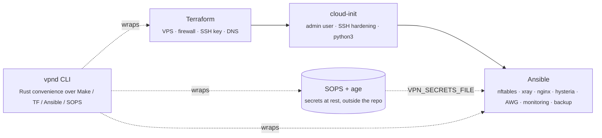
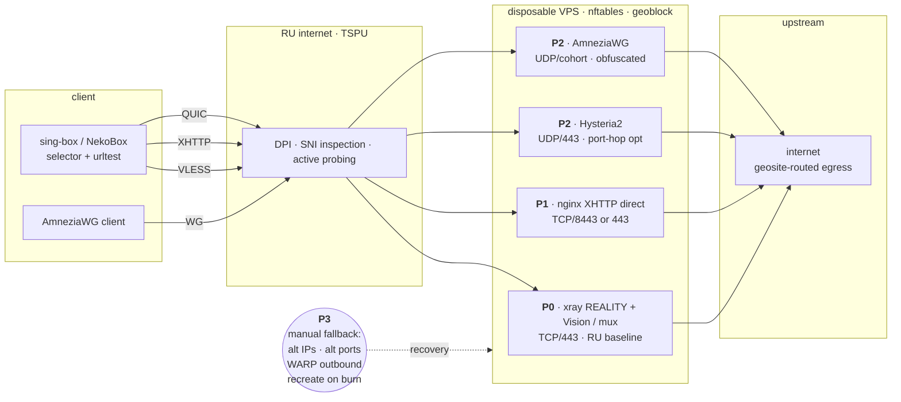
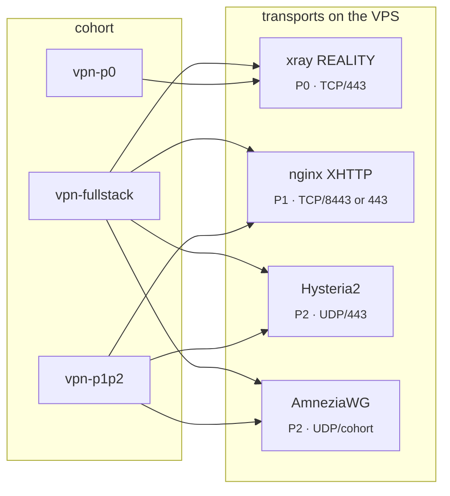

# vpn-deploy

[](https://github.com/po4yka/vpn-deploy/actions/workflows/ci.yml)
[](https://github.com/po4yka/vpn-deploy/actions/workflows/codeql.yml)
[](https://securityscorecards.dev/viewer/?uri=github.com/po4yka/vpn-deploy)
[](https://github.com/po4yka/vpn-deploy/releases)

Reproducible VPN deployment automation for the multi-profile access stack
(`P0` VLESS+REALITY+Vision → `P1` nginx+XHTTP direct → `P2` Hysteria2 +
AmneziaWG). Layered architecture: Terraform owns cloud resources,
cloud-init does first-boot bootstrap, Ansible owns runtime state, and
secrets live outside the repo (SOPS + age).

## Layers



Every layer is dry-runnable. Every layer has a rollback path. Nodes are
disposable: when an IP burns, recreate from git + secrets, do not repair.

## Stack

P0 is the RU baseline. P1 and P2 run alongside it as alternate transports;
clients carry selector + urltest logic so they automatically fail over to
whichever profile is still reachable. P3 is the operator-level recovery —
a burned IP is replaced, not repaired.



## Provider support

| Provider | Status |
|---|---|
| UpCloud | primary (v1) |
| Hetzner | implemented (v1.1) |
| Vultr | implemented (v1.1) |

Switch via `make PROVIDER=upcloud …`.

## Deploy profiles

Default is P0+P1+P2 on one node. Partial deploys come from cohort
`group_vars` files in `ansible/group_vars/`:

- `vpn-p0.yml` — REALITY only.
- `vpn-p1p2.yml` — XHTTP + Hysteria2 + AmneziaWG; REALITY off, nginx free
  to take 443.
- `vpn-fullstack.yml` — same as `all.yml` defaults, made explicit so a
  host in `[vpn-fullstack]` is unambiguous.



Assign a host to a cohort with `COHORTS=` on `render-inventory.sh`:

```bash
HOSTS="upcloud:p0" COHORTS="p0" ./scripts/render-inventory.sh
```

Or skip the inventory rebuild and tag-scope the play:
`ansible-playbook site.yml --tags p0` runs baseline + firewall + the P0
role only. Multi-VPS layouts: `docs/RUNBOOK-add-fallback.md`.

## Where to start

Agents and contributors: `AGENTS.md` and `CLAUDE.md` at the repo root carry
the working rules (per-folder variants apply when working inside a subtree).
Then:

1. `docs/QUICKSTART.md` — zero-to-working in ~30 minutes.
2. `docs/ARCHITECTURE.md` — how this repo maps to the P0–P3 stack.
3. `docs/CDN-DECISION.md` — explicit ADR: Cloudflare CDN is **not** the RU
   baseline; nginx-xhttp role is direct-only by default.
4. `docs/SECRETS.md` — SOPS+age model, age-key recovery, rotation.
5. `docs/AGE-RECOVERY.md` — Shamir-split the age key for k-of-n recovery.
6. `docs/TESTING.md` — coverage matrix and what's intentionally not tested.
7. `docs/BRANCH-PROTECTION.md` — apply required-status-check rules via GH API.
8. `docs/RUNBOOK-deploy.md` — full deploy procedure.
9. `docs/CLIENT-NOTES.md` — client-side bugs and version pins (AWG #2457,
   sing-box NaiveProxy padding leak, NaiveProxy v147 preamble).
10. `docs/SUBSCRIPTION-PLANE.md` — gap matrix against the wiki spec.
11. `docs/XRAY-RELEASE-LINE.md` — Xray-core 2026 release-line tracker
    (v26.2.6 → v26.5.3) with breaking-change notes for upgrades.
12. `docs/AWG-COHORTS.md` — AmneziaWG cohort obfuscation profiles
    (RTK South, MTS/Beeline/MegaFon).
13. `docs/MULTI-COHORT.md` — multiple VLESS+REALITY inbounds per host,
    each with its own port/flow_mode/finalmask/clients.
14. `docs/MULTI-OPERATOR.md` — per-scope SOPS rules, role-scoped secrets
    files, audit-log boundaries.
15. `docs/SUBSCRIPTION-HOST-SEPARATION.md` — run the subscription
    delivery role on a dedicated VPS via `vpn_subscription_only`.
16. `docs/CI-REAL-DEPLOY.md` — workflow_dispatch ephemeral-UpCloud
    deploy gate for PRs labelled `ci-real-deploy`.

Operational runbooks: `docs/RUNBOOK-{rotate,rollback,incident,restore,add-fallback}.md`.

## Contributing

PRs welcome — see `CONTRIBUTING.md`. Subjects follow Conventional Commits;
release-please picks them up automatically.

## Security

Critical issues (active probing, IP burn, key leak) → private channel per
`.github/SECURITY.md`. Don't open public issues for those.

## Make targets

```
# Core lifecycle
make init        # terraform init for the chosen PROVIDER
make validate    # fmt, validate, gitleaks, ansible-lint
make decrypt     # sops --decrypt → /tmp/vpn-<env>.secrets.yaml
make plan        # terraform plan -out=<env>.tfplan
make apply       # terraform apply <env>.tfplan
make inventory   # render Ansible inventory from terraform outputs
make wait        # wait for cloud-init to finish on the new VPS
make dry-run     # ansible-playbook --check --diff
make deploy      # ansible-playbook site.yml
make verify      # post-deploy verification playbook
make clean       # shred decrypted secrets

# Rollback / rotation
make rollback-xray ROLLBACK_XRAY_VERSION=vX.Y.Z
make rollback-config
make rotate-credentials

# Operations
make destroy                              # safe, double-confirmation destroy
make backup-state                         # age-encrypt local TF state
make burn-check                           # external IP reachability probe
make diff-secrets                         # drift detection
make emit-singbox CLIENT=<name>           # full sing-box client JSON
make install-hooks                        # one-time pre-commit setup
make molecule-test ROLE=<name>            # role-level idempotence test
make validate-target                      # pre-deploy REALITY target probe (8-step audit)
make scan-targets CIDR=<range>            # discover REALITY targets via RealiTLScanner
make smoke-test                           # end-to-end traffic test (real proxy dial)
make blue-green GREEN_ENV=<name>          # orchestrate blue-green replacement
```

## Hard rules

- No secrets in git, in Terraform state, in Terraform variables/outputs, in
  cloud-init `user_data`, in Ansible debug output, or in screenshots.
- No public admin panel. No remote installer piped into a root shell.
- One UUID / one shortId / one peer key **per device**, never shared.
- Pinned versions. Pre-release versions go through staging only.
- CI gate: gitleaks must pass with the `.gitleaks.toml` rules in this repo.

## License

Public domain (see `LICENSE`).
